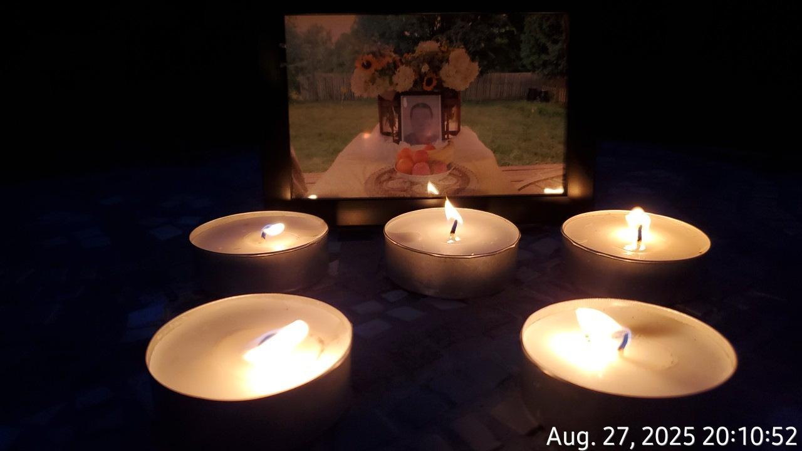

--

# **In Memory of My Brother (1972–2022)**

## Early Life  
My brother was born on March 3, 1972, in a harsh rural countryside where life offered little comfort and even less protection. From the beginning, he faced a world that demanded more from him than any child should ever have to give. Food was scarce, care was inconsistent, and the emotional landscape of our home was shaped by a mother whose anger and instability fell hardest on him. He endured scolding, humiliation, and physical harm that no child should ever experience. These early wounds forced him to grow up long before his time.  
Yet even in those conditions, he developed a quiet resilience — a strength that would carry him through the rest of his life.

## Growing Up Under Pressure  
As he entered his teenage years, the pressure at home only intensified. He left several times, not out of rebellion, but out of desperation for a moment of peace. By nineteen, he was pushed into an early marriage he was not ready for. He tried to build a life anyway and became a father to a baby girl, carrying hopes for her that he had never been allowed to have for himself. But the marriage, strained by family interference and emotional tension, eventually ended in divorce.

## A Life of Hard Work  
Without the chance to finish high school, he entered the workforce early. He later joined road construction crews as a roller driver — long days under the sun, surrounded by heat, dust, and rising asphalt fumes. I remember seeing him sitting on top of the machine, the air shimmering around him. He looked strong and capable, but none of us knew how much that environment might take from him. Years of exposure to harsh conditions may have contributed to the illness that would later claim his life.

## His Greatest Act of Love  
Despite everything he endured, he remained a warm‑hearted person. He helped others whenever he could, offering the kind of support he himself had rarely received. The clearest reflection of his character came later in life, when he adopted my mentally ill son and raised him as his own. For thirteen years, he cared for him with patience, loyalty, and love. He gave my son the stability and kindness he himself had been denied. This was not just responsibility — it was the purest expression of who he truly was.

## His Final Months  
In May 2022, he discovered a tumor on his neck and was diagnosed with cancer. The illness progressed quickly. For 102 days, he fought with the same quiet strength that had carried him through every struggle of his life. On August 28th, 2022, he passed away, leaving behind a legacy of endurance, generosity, and quiet goodness.

## How He Is Remembered  
His story did not end with his passing. I remember him on every important day — his birthday, his death day, the traditional memorial days, and each New Year. These moments keep him close. They are my way of giving him the gentleness and recognition he deserved while he was alive.  
He lives on in the people he helped, in the love he gave, and in the quiet strength he carried through every hardship.

---

# **A Message to My Brother**

> I carry you with me every day. I remember your strength, your kindness, and the way you kept going even when life gave you almost nothing in return. You protected others even when no one protected you. You gave love even when you received so little of it.  
>  
> You raised my son as your own for thirteen years, giving him patience, safety, and warmth. That gift is something I will honour for the rest of my life.  
>  
> I remember you on your birthday, on the day you left, on every traditional memorial day, and every New Year. These moments are my way of keeping you close — of giving you the respect and gentleness you deserved.  
>  
> I hope you have found peace now, a peace that life never gave you. Your suffering is over, but your memory is not. You live on in the people you helped, in the love you gave, and in the quiet strength you carried through every hardship.  
>  
> I miss you, and I will continue to honour you for as long as I live.

---

